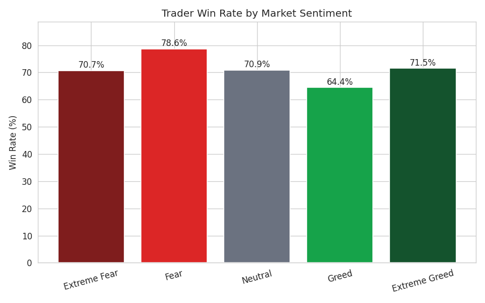
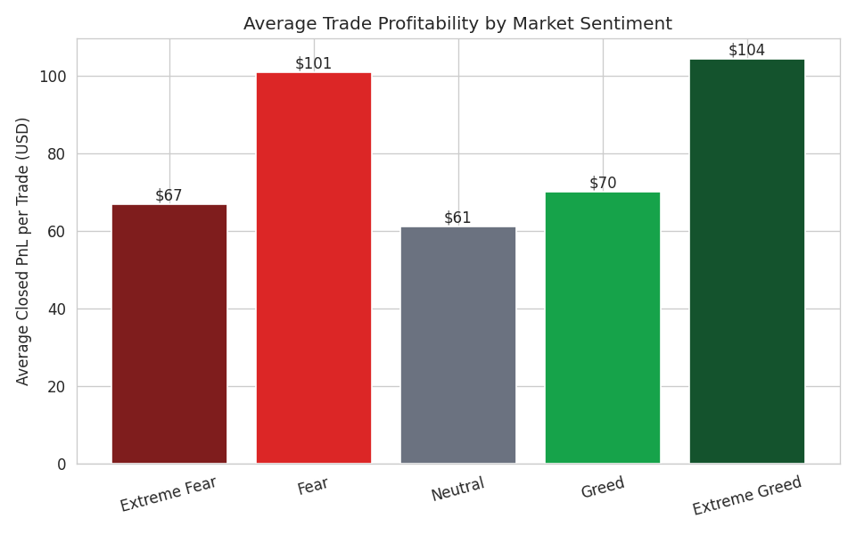
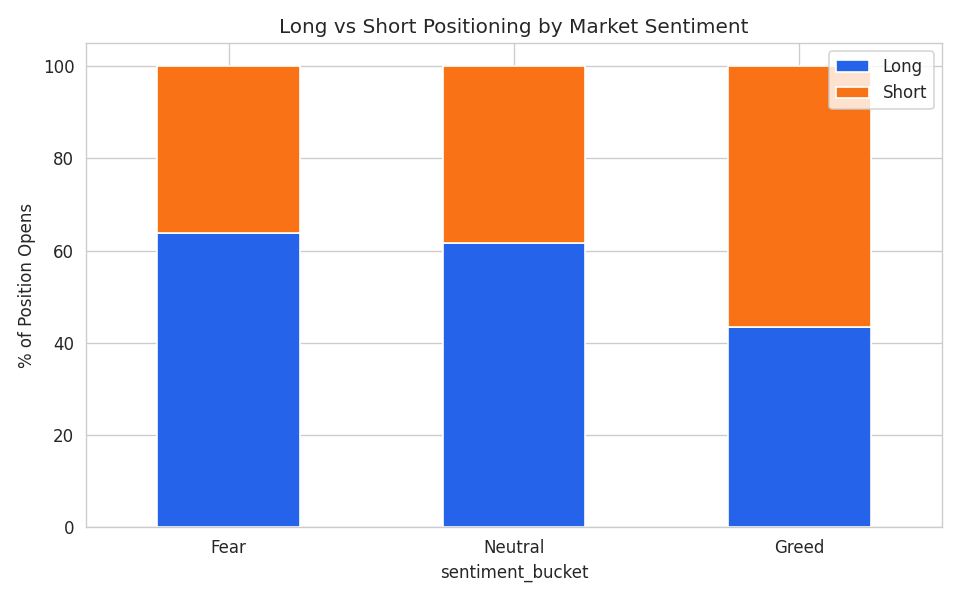
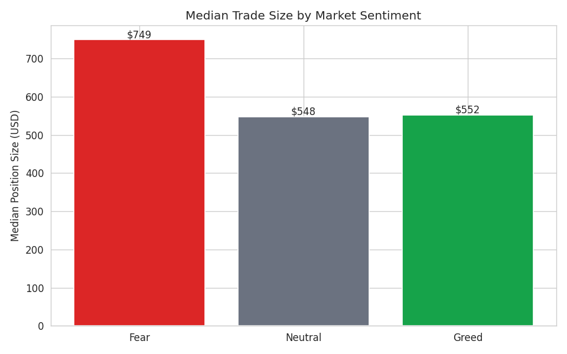
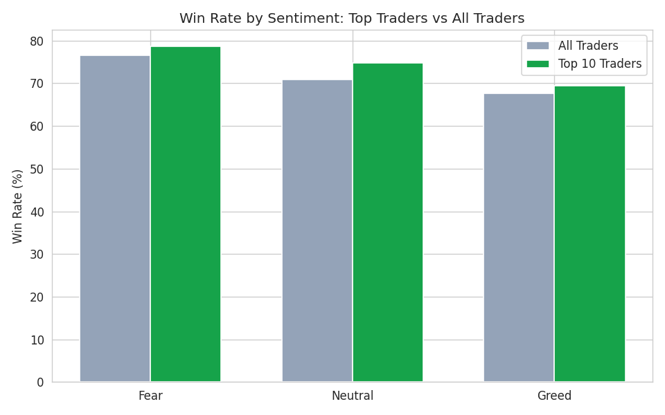
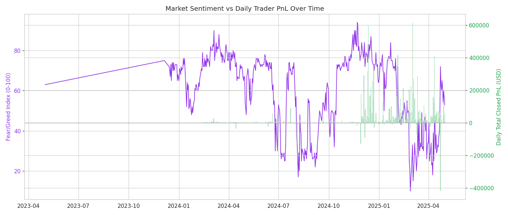

# Trader Performance vs. Market Sentiment
### An analysis of Hyperliquid trading activity against the Bitcoin Fear & Greed Index

**Data:** 211,224 trades from 32 accounts on Hyperliquid (May 2023 – May 2025), matched
against the Bitcoin Fear/Greed Index for the same 479 trading days. 100% of trades were
successfully matched to a sentiment reading for their day.

---

## 1. Headline finding: traders do better when the market is fearful, not greedy

Across every cut of the data, trading during **Fear** conditions outperformed trading
during **Greed** conditions - on win rate, average PnL per trade, and total PnL.

| Sentiment Bucket | Trades | Total PnL | Avg PnL/Trade | Win Rate |
|---|---:|---:|---:|---:|
| Fear | 44,259 | $4,087,700 | $92.36 | **77%** |
| Neutral | 21,074 | $1,292,354 | $61.32 | 71% |
| Greed | 55,970 | $4,816,952 | $86.06 | 68% |

The gap is even sharper at the extremes of the index:

| Sentiment Class | Win Rate | Avg PnL/Trade |
|---|---:|---:|
| Extreme Fear | 71% | $66.98 |
| Fear | **79%** | **$100.96** |
| Neutral | 71% | $61.32 |
| Greed | 64% | $70.11 |
| Extreme Greed | 72% | $104.48 |

**Takeaway:** the single best-performing regime in the dataset is plain "Fear" (not even
Extreme Fear) - 79% of trades closed in profit, well above the 68% seen during Greed. This
lines up with the classic contrarian idea that fear-driven markets create better entries
for disciplined traders, while greed-driven markets tempt people into chasing.

---

## 2. Traders lean long in Fear and flip to short in Greed - and it works against them in Greed

| Sentiment | % Long Opens | % Short Opens |
|---|---:|---:|
| Fear | 63.8% | 36.2% |
| Neutral | 61.7% | 38.3% |
| Greed | **43.4%** | **56.6%** |

This is a genuinely interesting behavioral pattern: traders in this dataset are net long
during Fear (buying into weakness) but flip to net **short** during Greed - actively betting
against the rally. Combined with finding #1, this means the crowd's short bets placed
during Greed periods are landing in the bucket with the *lowest* win rate (68%). Whether
that's the short bias causing the lower win rate, or just correlated with more crowded/noisy
trading in Greed, is worth digging into further with entry/exit timing data.

---

## 3. Position sizing shrinks as sentiment shifts from Fear to Greed

| Sentiment | Median Trade Size | Mean Trade Size |
|---|---:|---:|
| Fear | $749 | $7,182 |
| Neutral | $548 | $4,783 |
| Greed | $552 | $4,574 |

Traders are sizing up during Fear and sizing down during Greed - the opposite of what
you'd expect if greed were driving overconfidence into bigger bets. One read: the accounts
in this dataset treat Fear as the "high-conviction" regime and Greed as more speculative/
churn-heavy (more, smaller trades - see trade counts in section 1: 55,970 trades in Greed
vs. 44,259 in Fear despite Fear producing more profit per trade).

---

## 4. Top performers are *more* sentiment-sensitive than average traders, not less

| Sentiment | All Traders Win Rate | Top-10 Traders Win Rate |
|---|---:|---:|
| Fear | 77% | **79%** |
| Neutral | 71% | 75% |
| Greed | 68% | 69% |

The top 10 accounts by total realised PnL (who together account for a large share of the
$10.2M total realised profit in this dataset) show the *same* Fear > Neutral > Greed
ordering as the full population, and their edge over average traders barely changes across
regimes. This suggests the sentiment effect is a genuine market-wide dynamic - not an
artifact of a few skilled accounts trading differently - and that skill shows up as a
roughly constant win-rate premium layered on top of whatever the regime offers everyone.

---

## 5. Sentiment index level has weak direct correlation with daily PnL

| | fg_value | total_pnl | win_rate | total_volume |
|---|---:|---:|---:|---:|
| fg_value | 1.00 | -0.08 | 0.15 | -0.26 |

The raw Fear/Greed *index value* barely correlates with daily total PnL (-0.08) or daily
volume (-0.26, i.e. more fear → slightly *more* volume). This matters: it means the
relationship isn't simply "the more extreme the reading, the better/worse traders do" -
it's specifically the **Fear vs. Greed classification**, and the long/short and sizing
behavior around it, that drives the performance gap, not the raw score. Bucket-level
effects (section 1) are much more informative than treating the index as a continuous
signal.

---

## 6. Practical strategy implications

1. **Don't fade Fear reflexively - lean into it.** The data shows Fear days are this
   population's best-performing regime, not their worst. A rules-based system that
   increases position sizing or trade frequency during Fear (mirroring what the top
   accounts already do) would have been directionally correct over this 2-year window.

2. **Treat Greed as a "reduce size, raise selectivity" regime**, not a "flip short and
   go" regime. The crowd's short bias in Greed correlates with the *lowest* win rate in
   the dataset - shorting into greed isn't paying off as well as the position sizes
   suggest people believe it should.

3. **Use the 5-way classification, not the raw 0-100 score**, when building rules. The
   raw score's correlation with PnL is weak; the categorical regime (Fear/Neutral/Greed)
   is where the signal actually lives.

4. **Watch position-count vs. profit-per-trade trade-offs.** Greed periods generate more
   trades (55,970 vs. 44,259 in Fear) for less total edge per trade - a sign of
   overtrading. A simple "cool-down" or trade-frequency cap during Greed regimes could
   improve risk-adjusted returns without missing much upside.

5. **Regime-transition data is directionally interesting but too sparse to act on
   directly** (only 2-17 transition days per pair in this sample) - worth revisiting with
   more history or higher-frequency sentiment data before building a transition-based
   rule.

---

## Methodology notes

- "Performance" metrics (win rate, avg/median/total PnL) are computed only on trades that
  realise PnL (`Direction` containing "Close", plus generic `Buy`/`Sell` rows), since
  Hyperliquid opens always show `Closed PnL = 0` by construction and would dilute the
  numbers.
- Trades are joined to sentiment by calendar date (IST). Every trade in the dataset found
  a matching sentiment day (100% match rate).
- "Top 10 accounts" = top 10 by total realised PnL across the full period, not top 10 by
  win rate, to focus on traders who actually generated the bulk of aggregate profit.
- Full code and intermediate CSVs are included alongside this report so every number here
  can be reproduced or re-sliced.
